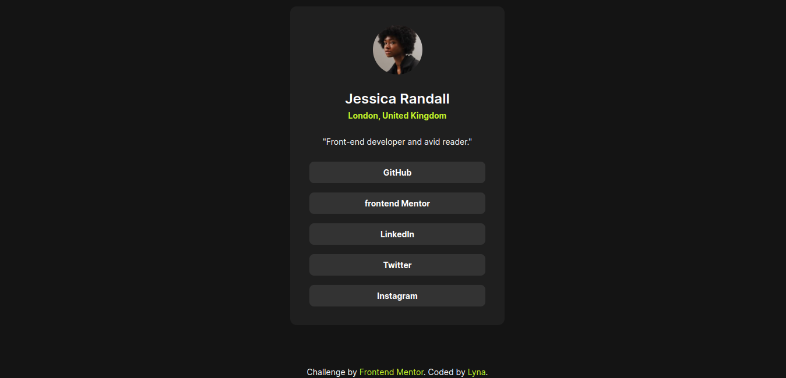

# Frontend Mentor - Social links profile solution

This is a solution to the [Social links profile challenge on Frontend Mentor](https://www.frontendmentor.io/challenges/social-links-profile-UG32l9m6dQ). Frontend Mentor challenges help you improve your coding skills by building realistic projects.

## Table of contents

- [Overview](#overview)
  - [The challenge](#the-challenge)
  - [Screenshot](#screenshot)
  - [Links](#links)
- [My process](#my-process)
  - [Built with](#built-with)
  - [What I learned](#what-i-learned)
  - [Continued development](#continued-development)
- [Author](#author)

## Overview

### The challenge

Users should be able to:

- See hover and focus states for all interactive elements on the page

### Screenshot

### Links

- Solution URL: (https://www.frontendmentor.io/solutions/responsive-social-media-links-profile-Vj7Tupak2n)
- Live Site URL: (https://lynaifr.github.io/Social-links-profile/#)

## My process

### Built with

- Semantic HTML5 markup
- CSS custom properties
- Flexbox

### What I learned
Learned about CSS reset and optimized code.

### Continued development

Need to learn to code better and faster.

## Author
- GitHub - [Lyna IFRAH](https://github.com/lynaIFR)
- Frontend Mentor - [@lynaIFR](https://www.frontendmentor.io/profile/lynaIFR)
